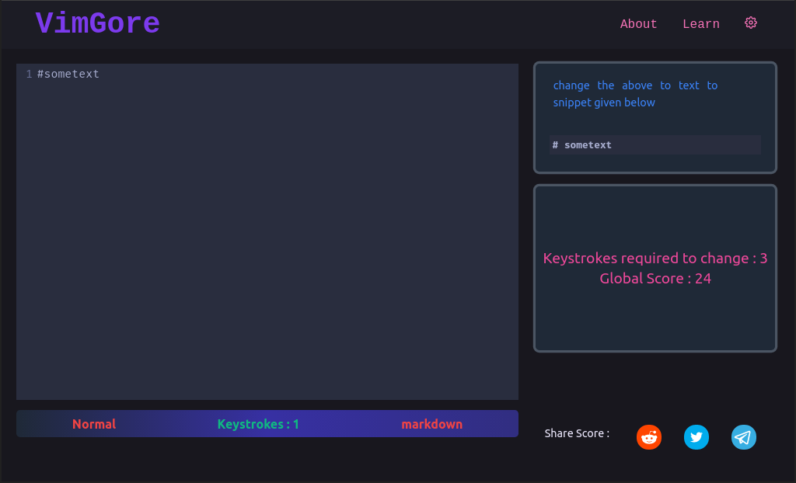

<h1 align="center">
   
  Vim Gore
   
</h1>

<h4 align="center">An Interactive Game to learn Vim</h4>

<h4 align="center"><a href="">Play Here</a> </h4>

## How To Use

You will see an editor and a snippet in it. There will be a task menu also where you can see the code
to write and also the minimum keystrokes required. If number of keystrokes is less than minimum keystrokes
then you are awarded 5 point other wise you are awarded 1 point only

--------

This is in process of making it better. To use VimGolf API for challenges, maybe to do it in Vue or something...  
